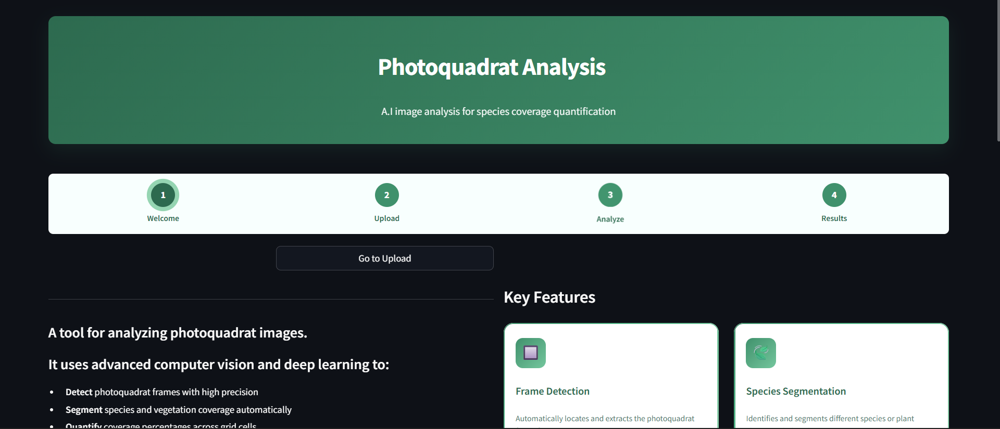

# EcoQuad
Automated AI-powered analysis tool for quantifying species coverage in photoquadrat images using deep learning.

## What is it?
An AI tool designed to analyze photoquadrat images. It helps users measure species presence and percentage coverage.  It uses a multi-model CV and automated image processing.  Currently, EcoQuad is in development and supports analysis of two species: _Rissoella_ and _Chthamalus_. Using advanced computer vision, it:

- **Detects** the photoquadrat frame automatically
- **Identifies** different species in the image
- **Calculates** coverage percentages per grid cell
- **Generates** reports and visualizations in seconds


## Installation

### Local Setup

1. **Clone the repository**
   ```bash
   git clone https://github.com/DolapoSalim/photoquadrats_analysis
   cd photoquadrats_analysis
   ```

2. **Install dependencies**
   ```bash
   pip install -r requirements.txt
   ```

3. **Add models**
   Create a `models/` folder and place your YOLO models:
   ```
   models/
   ├── new_frame_detector.pt
   └── final_detector.pt
   ```

4. **Run the app**
   ```bash
   streamlit run app.py
   ```

The app will open at `http://localhost:8501`

## File Structure

```
photoquadrats_analysis/
├── app.py                    # Main application
├── requirements.txt          # Python dependencies
├── models/
│   ├── new_frame_detector.pt
│   └── final_detector.pt
├── assets/
│   └── header.png           # README header image (1200×400px)
└── README.md
```

## Model Requirements

You need two pre-trained YOLO models:

1. **Frame Detection Model** (`new_frame_detector.pt`)
   - Detects photoquadrat frame in images
   - Trained on quadrat photos

2. **Species Segmentation Model** (`final_detector.pt`)
   - Segments species in cropped frames
   - Identifies _Chthalamus_, _Risoella_, and other species


---

**Made with ❤️ for ecological research**
_**Data used for production are intellectual properties of the ecology lab, Dept of Biology, University of Pisa**_